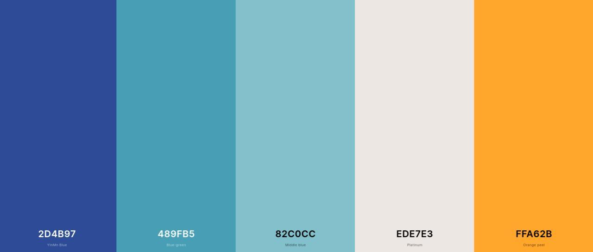
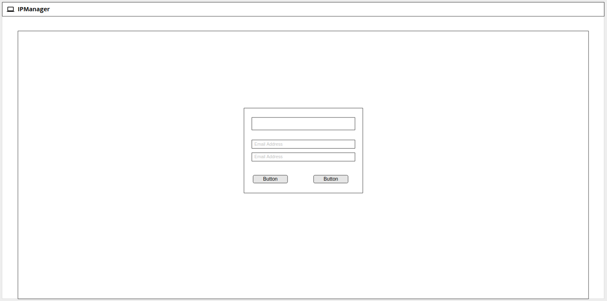
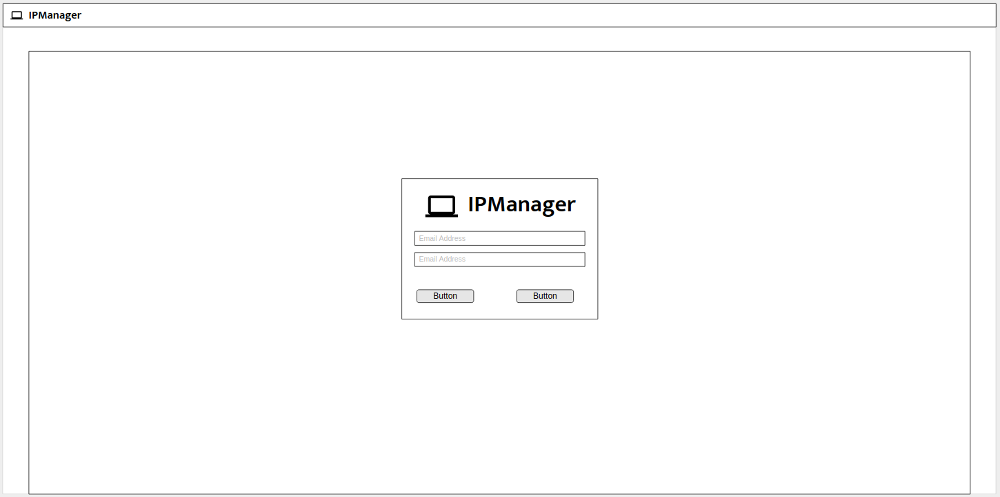
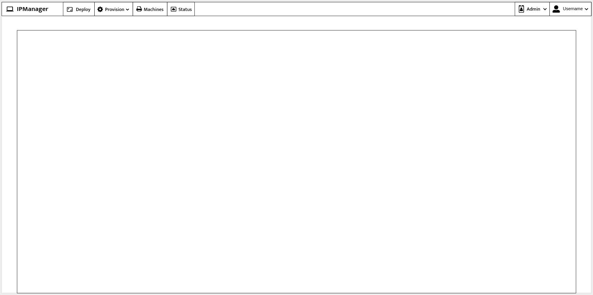
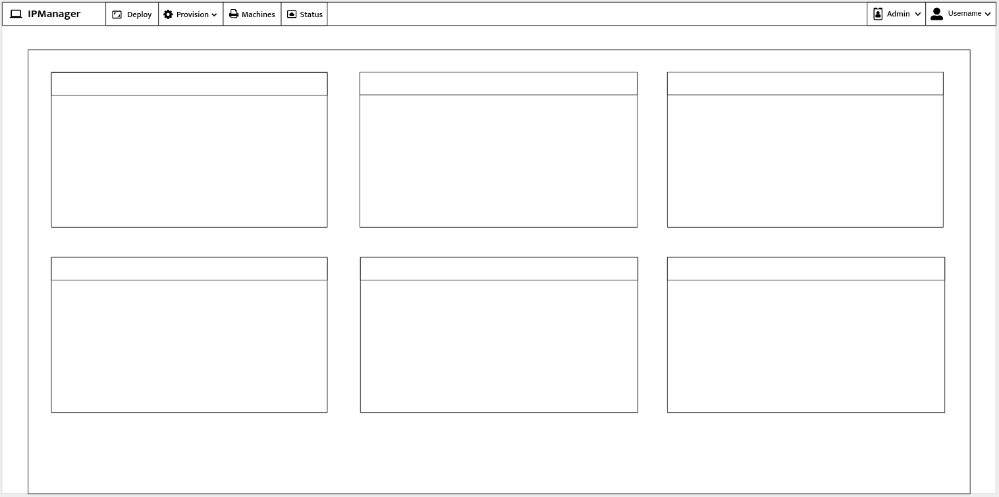
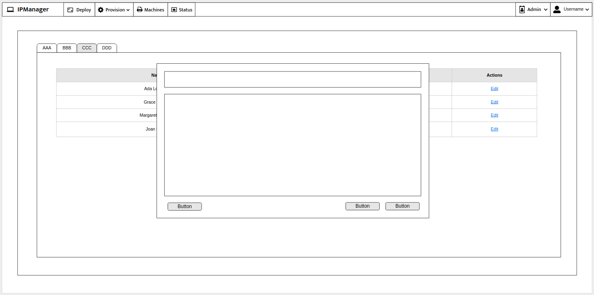
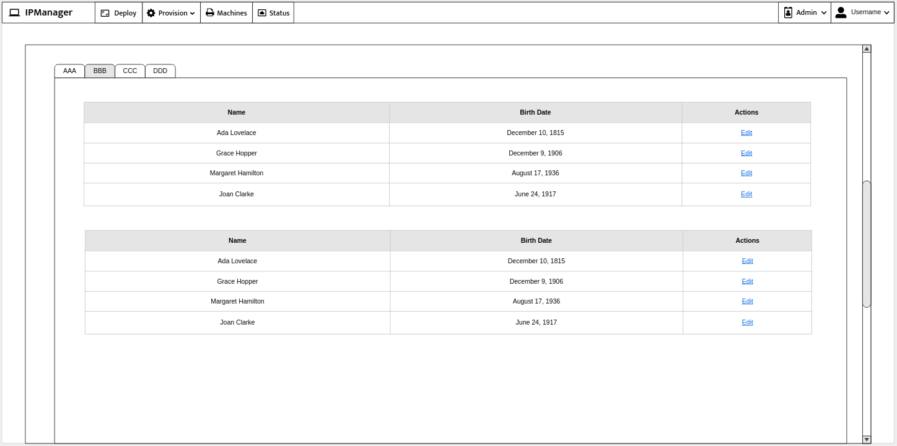
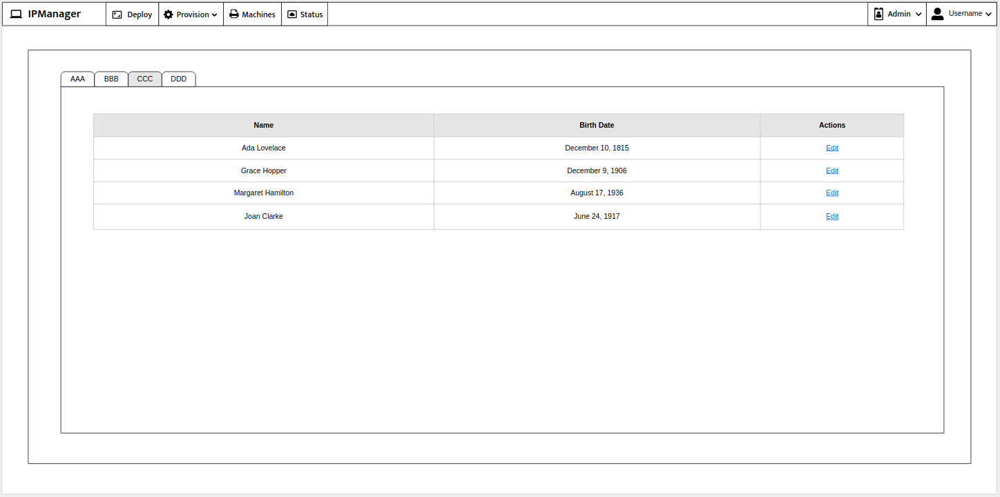

# Diseño

En este documento se encuentran los diferentes wireframes diseñados para el frontend.

## Tipografía

### Logo

- Mukta Semi-Bold 600

### Texto

- Lato Regular 400
- Roboto Regular 400

### Iconos

Los iconos son de Font Awesome.

- IPManager: laptop
- Deploy: docker
- Provision: cogs
  - Playbooks: tasks
  - Hosts: hdd
- Machines: server
- Status: chart-pie
- Admin: user-shield
- User: user

## Paleta de colores

## Wireframes

### Login

### Blank page

### Tarjetas inicio

### Popover

### Secciones

## Uso de colores y tipografías

### Menú superior

- Color: #2D4B97 (YinMin Blue)
- Texto: #FFFFFF (Blanco)
- Iconos: #FFFFFF (Blanco)
- Botones: #2D4B97 (YinMin Blue)
- Botones (hover): #489FB5

### Fondo

- Color: #82C0CC

### Botones

- Primario: #FFA62B
- Secundario: #489FB5

### Cabeceras y popover

- Primario: #489FB5

- Secundario: #82C0CC

- Fondo: #EDE7E3

  